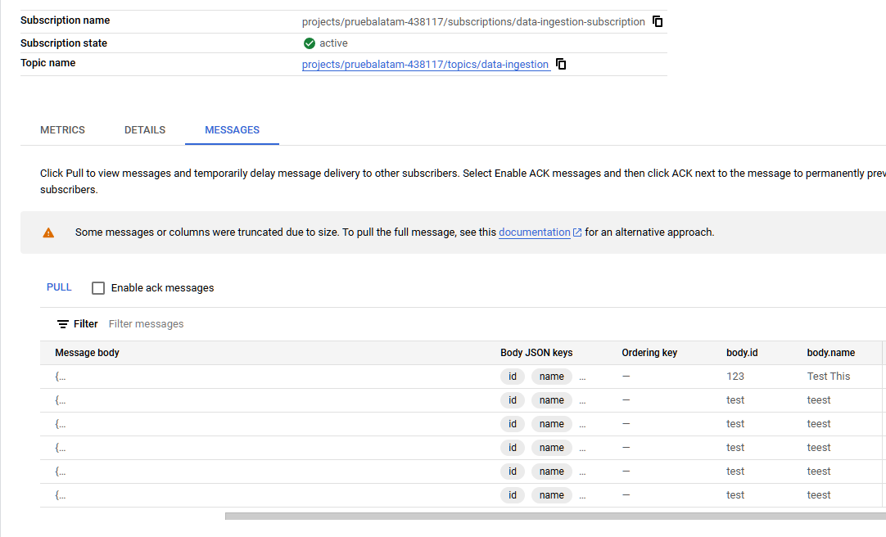
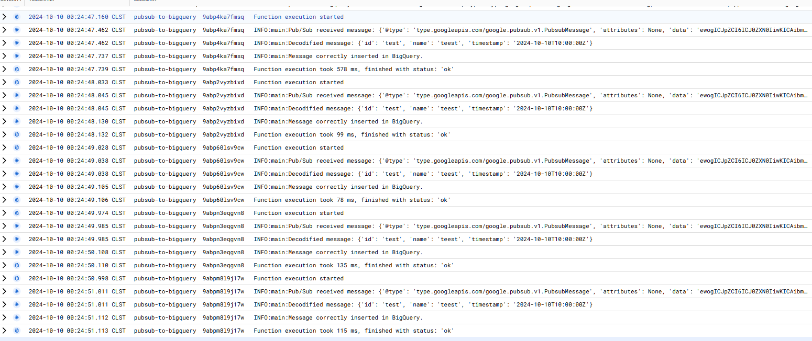
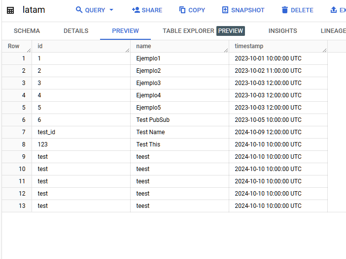
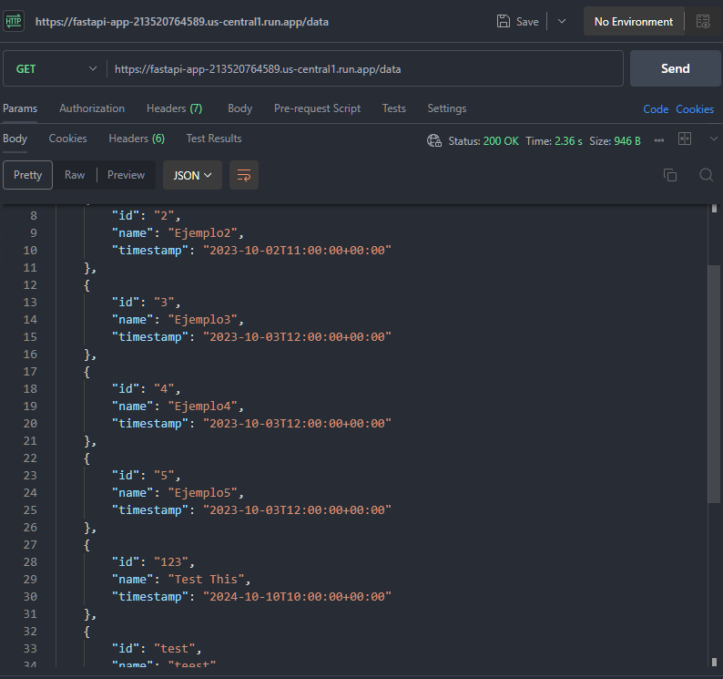
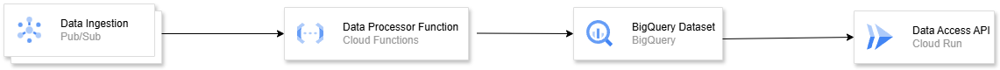

# Desafio Técnicos DevSecOps/SRE
 El desafio consiste en un sistema para ingestar y almacenar datos en una base de datos para analizarlos y luego deben ser expuestos por una API para que puedan ser consumidos.

## 1. Infraestructura e IaC

Para esta infraestructura la dividiremos en 3 partes:

- **Ingesta de datos (Esquema Pub/Sub)**: Para esto se usará Google Cloud Pub/Sub junto a un Cloud Function que se activará cada vez que se reciba un mensaje.

- **Base de datos**: Para esto se usara BigQuery con su respectivo esquema

- **Exposición de datos mediate una API**: Se levantará la API usando Cloud Run, permitiendo que terceros accedan a los datos almacenados mediante un endpoint.

Esta infraestructura se levantará usando Terraform.

## 2. Aplicaciones y flujo CI/CD

En este caso como CI/CD se usó Git Actions, dividido en el levantamiento de toda la infraestructura que incluye los permisos de la service account correspondiente,
el dataset y la base de datos, junto con el Pub/Sub Topic, el Bucket, la Cloud Function creada con el Pub/Sub junto a sus respectivos triggers y suscripción.
La API se levantó en otro CI/CD mediante Docker usando Cloud Run para mayor facilidad y rápidez de levantamiento.

Esto se levanta usando una cuenta de servicio en GCP usando solamente los permisos necesarios con los secretos guardados en Github Secrets para mayor seguridad.

Además, se guardaron el **PROJECT_ID**, **DATASET_ID** y **TABLE_ID** en variables para evitar la repetición de código.

El flujo de datos se compone de la siguiente manera:

1. Los datos se envían como mensajes a un tópico de Pub/Sub de Google Cloud, que es el punto de entrada de los datos. Los datos se envian en formato JSON como en el siguiente ejemplo:

```json
{
  "id": "123",
  "name": "Test Name",
  "timestamp": "2024-10-10T10:00:00Z"
}
```
Además, desde el PubSub es posible visualizar los mensajes enviados, sean erróneos o no:



2. Google Cloud Pub/Sub recibe estos mensajes y los distribuye a las suscripciones correspondientes (en este caso llamado `data-ingestion-subscription` creado mediante un modulo de Terraform)
3. La cloud functión está suscrita al tópico de Pub/Sub y se triggerea automáticamente cada vez que llega un mensaje:
    - La función decodifica el mensaje, lo procesa, y prepara los datos para el almacenamiento.
    - La función contiene validaciones para asegurar que el mensaje cumple con el formato requerido.


4. La cloud function ingresa los datos a una tabla en BigQuery llamada `latam`, que contiene las columnas `id`, `name` y `timestamp`, almacenandose en tiempo real.


5. Los datos se exponen mediante una API con la url *`https://desafio-latam-213520764589.us-central1.run.app`* en la cual usando un GET al endpoint `/data`, es posible obtener toda la información contenida en la tabla de BigQuery.



El diagrama muestra el flujo de la data:



## 3. Pruebas de Integración y Puntos Críticos de Calidad

1. Las pruebas de integración principales son el *[test_integration.py](challengelatam/test/test_integration.py)* y el *[test_validation_data.py](challengelatam/test/test_validation_data.py)*. Estas pruebas verifican que la API está disponible y respondiendo exitosamente en el endpoint esperado, lo cual confirma que el servicio está correctamente desplegado y que la API devuelve datos de acuerdo con el esquema y el formato esperado, validando que el contenido es preciso y que corresponde a los datos almacenados en la base de datos. Estas pruebas están integradas en el flujo de CI/CD para ejecutarse después de desplegar la API en Cloud Run. Esto asegura que cualquier cambio o actualización de la API sea verificado automáticamente, manteniendo la integridad y disponibilidad del sistema en cada despliegue.

Se agregaron otras pruebas como el *[test_health.py](challengelatam/test/test_health.py)* y *[test_invalid_endpoint.py](challengelatam/test/test_invalid_endpoint.py)* como extras, pero no son parte de la prueba de integración.

2. Otras pruebas de integración que se podrían aplicar incluyen:

    - **Prueba de respuesta sin datos en la tabla**: Esta prueba asegura que la API maneje correctamente los casos en los que la tabla de datos está vacía, sin generar errores inesperados. La API debería responder con un código 200 y un mensaje o un objeto vacío, indicando que no hay datos disponibles. Esto permite verificar la robustez de la API al enfrentarse a una base de datos sin registros.

    - **Prueba con datos mal formateados**: Es posible que la base de datos reciba entradas con campos incompletos o con un formato inesperado. Una prueba de integración puede simular esta situación para verificar que la API maneja adecuadamente los errores de formato en lugar de interrumpir su servicio. Esta prueba implica agregar datos con errores en la tabla y observar que la API devuelva un mensaje de error informativo, sin interrumpir el flujo normal del servicio.

    - **Prueba de integridad del formato de respuesta**: Para asegurar que el cliente siempre recibe el mismo formato de datos, esta prueba verifica que el esquema de los datos devueltos por la API se mantenga constante. Esto ayuda a que los usuarios de la API tengan una experiencia uniforme y evita fallos de compatibilidad con sistemas consumidores.

3. Se podrían definir los siguiente puntos críticos del sistema a considerar:

    - **Sobrecarga de la API**: La API podría sobrecargarse si recibe muchas solicitudes simultáneas que podrían provocar que se ralentice o se bloquee.

    - **Escalabilidad del Cloud Run y límites de recursos**: La API está desplegada en Cloud Run, lo que puede causar limitaciones de CPU y memoria que afecten su rendimiento y capacidad de respuesta en situaciones de alto tráfico. Esto se podría medir con el monitoreo de recursos en Cloud Run para medir el uso de CPU, memoria y tiempo de ejecución. Se podrían realizar pruebas de carga para validar que la API funciona bajo muchas solicitudes.

    - **Sobreutilización o costo excesivo**: Si bien esto no corresponde especificamente a algo técnico del sistema, si la API o la función Pub/Sub son llamadas frecuentemente, podría haber un aumento significativo en los costos. Se podrían configurar alertas de presupuesto en GCP para recibir notificaciones si el costo excede el límite establecido. Simular un escenario de alto tráfico serviría estimar el costo y revisar si es posible optimizar el diseño o configuración para reducir gastos.

    - **Integridad de datos**: Si la Cloud Function que inserta datos en BigQuery falla, podría resultar en datos incompletos o corruptos, lo cual afecta el análisis. Pruebas de integración que verifiquen la integridad de los datos después de ser insertados podría ser una medida para esto, además de monitorear los logs de la Cloud Function para detectar errores.

    - **Autenticación y control de accesos**: Se podría añadir una autenticación mediante Bearer Tokens para que solo las cuentas autorizadas puedan acceder a la API, añadiendo una capa de seguridad. Se podrían configurar pruebas para simular el acceso con tokens válidos e inválidos, además de monitorear los logs de acceso.

4. Si bien en el punto anterior se abordaron las maneras de tratar, medir y testear los puntos críticos, acá se expandirá un poco más eso:

    - #### **Sobrecarga de la API**: 
      - Si el tráfico aumenta considerablemente, se podría habilitar un balanceador de carga para distribuir las solicitudes entre varias instancias de la API, asegurando que no se sobrecargue una sola instancia.

      - Aprovechar la función de escalado automático de Cloud Run para que bajo demanda se generen más instancias de la API y puedan atender mayor tráfico. Esto puede configurarse con límites para evitar costos excesivos.

    - #### **Escalabilidad y recursos en Cloud Run**:
      - Ajustar los recursos asignados (CPU y memoria) en Cloud Run según el perfil de uso de la API. Realizar pruebas de rendimiento para encontrar la configuración ideal que minimice el uso sin sacrificar rendimiento.

      - Realizar pruebas de carga periódicas para identificar el punto de quiebre de la API y ajustar la configuración en consecuencia.

      - Configurar límites de tiempo en las solicitudes para que las llamadas que demoren demasiado se terminen, liberando recursos para nuevas solicitudes y evitando bloqueos.

    - #### **Mitigación de costos**:
      - Establecer un límite máximo de instancias para evitar un escalado excesivo y reducir costos.

      - Usar técnicas como _batching_ en la Cloud Function para agrupar mensajes de Pub/Sub y hacer menos inserciones a BigQuery, lo cual reduciría el costo en operaciones de escritura.

    - #### **Integridad de datos en BigQuery**:
      - Configurar mecanismos de reintento en la Cloud Function para manejar fallos intermitentes en la inserción de datos. Esto puede evitar que datos válidos se pierdan.

      - Implementar validaciones adicionales en la Cloud Function para garantizar que solo datos válidos ingresen a BigQuery, evitando corrupción de datos.

      - Configurar backups automáticos de BigQuery.

    - #### **Autenticación y control de accesos**:
      - Implementar Bearer Tokens para autenticar y autorizar el acceso a la API. Configurar un sistema de autenticación con IAM para manejar accesos y permisos.

## 4. Métricas y Monitoreo

1. Las tres métricas críticas propuestas para entender la salud y rendimiento del sistema end-to-end son:

    - **Tiempo de respuesta de la API**: Esta métrica mide el tiempo que la API demora en responder cada solicitud, desde el momento en que se recibe hasta que devuelve la respuesta. Un aumento en este tiempo podría indicar problemas de rendimiento o carga en la API. Un tiempo de respuesta elevado perjudica la experiencia del usuario y puede ser una señal temprana de que los recursos están sobrecargados o que se necesita optimización.

    - **Tasa de Errores en la Cloud Function**: Mide el porcentaje de ejecuciones de la Cloud Function que resultan en errores. Esto incluye fallos en la inserción de datos en BigQuery o en la decodificación de mensajes de Pub/Sub. Un aumento en esta métrica puede señalar que hay datos mal formateados, fallos intermitentes o configuraciones erróneas.

    - **Número de Mensajes en Cola (Pub/Sub)**: Indica cuántos mensajes se encuentran en cola en Pub/Sub en espera de ser procesados por la Cloud Function. Si esta métrica crece constantemente, puede indicar que la Cloud Function no está procesando los mensajes con suficiente rapidez, lo cual podría causar retrasos en el procesamiento de datos y pérdida de mensajes.

2. Debido a que se usa Google Cloud Platform, las opciones más viables serían Google Cloud Monitoring con Google Cloud Logging. Google Cloud Monitoring permite configurar dashboards que dan una vista en tiempo real de las métricas críticas del sistema, además de dividirlas por componentes en el sistema como el PubSub, Cloud Function y la API.

    Las métricas claves para mostrar serían básicamente las señaladas en el punto 1:
    - #### **Tiempo de respuesta de la API**:
        - **Visualización**: Una gráfica de líneas que muestre el tiempo de respuesta promedio de la API a lo largo del tiempo, con puntos resaltados para valores extremos o tiempos de respuesta superiores al umbral establecido.

        - **Decisiones estratégicas**: Si la tendencia muestra un aumento (aumenta el tiempo), se podría decidir optimizar el código, escalar los recursos de Cloud Run o ajustar el balanceador de carga. Esto ayuda a garantizar una experiencia de usuario fluida.

    - #### **Tasa de Errores en la Cloud Function**:
        - **Visualización**: Una gráfica de barras que indique el porcentaje de ejecuciones con error frente a las exitosas en intervalos de tiempo determinados.

        - **Decisiones estratégicas**: Una tasa alta de errores podría significar problemas en la decodificación de mensajes o fallos en la inserción en BigQuery. Identificar rápidamente estos problemas permite implementar validaciones adicionales o reintentos automáticos en la Cloud Function para reducir errores futuros.

    - #### **Número de Mensajes en Cola (Pub/Sub)**:
        - **Visualización**: Una gráfica de área o líneas que muestre el número de mensajes en cola en Pub/Sub en tiempo real.

        - **Decisiones estratégicas**: Si la cola crece constantemente, puede ser necesario escalar la Cloud Function para procesar los mensajes más rápido o ajustar el batching para manejar mejor los picos de tráfico.

    Con estos paneles, se puede visualizar la salud general del sistema en tiempo real y recibir alertas en caso de que alguna métrica supere los umbrales críticos. Así podrían implementarse optimizaciones de costos o ajustes de recursos de manera anticipada, manteniendo la estabilidad y eficiencia del sistema.

3. Como se indicó anteriormente, la forma más rápida de implementar monitoreo y recolección de métricas es con Google Cloud Monitoring junto a Google Cloud Logging. Para la recolección de métricas en base a las 3 métricas indicadas en esta parte se usaría lo siguiente:

    - **API en Cloud Run**: Se habilitaría la integración de Google Cloud Monitoring y Logging en el servicio de Cloud Run. Esto permite recolectar métricas como tiempos de respuesta, tasa de solicitudes y errores. Se configura automáticamente al desplegar la API en Cloud Run.

    - **Cloud Function (Pub/Sub a BigQuery)**: Google Cloud Functions permite monitorear métricas como número de ejecuciones, errores y latencia. Estas métricas se habilitan al activar la integración con Monitoring y Logging en la configuración de la Cloud Function.

    - **Pub/Sub**: Para los mensajes en cola y la cantidad de mensajes procesados, GCP proporciona métricas que se pueden activar en Pub/Sub, tales como el número de mensajes en cola y errores de procesamiento.

    Para las alertas, estas pueden configurarse en Google Cloud Monitoring con umbrales específicos. Por ejemplo, un tiempo de respuesta de API superior a un valor específico o una alta tasa de errores en la Cloud Function. Estas alertas pueden notificarse mediante correos electrónicos o integraciones de mensajería para una respuesta rápida.

    Para la visualización, se usarían paneles en Clouyd Monitoring Dashboards que incluyan gráficas y tablas para las métricas clave. Esto permite una vista centralizada de los datos en tiempo real y facilita la identificación de problemas y tendencias. Además, cada panel incluiría gráficos personalizados para el tiempo de respuesta de la API, tasa de errores de Cloud Function y número de mensajes en cola de Pub/Sub.

    Con Cloud Logging, se almacenarían todos los eventos registrados en cada componente del sistema para análisis posterior, permitiendo revisar el historial de eventos y detectar patrones o problemas recurrentes. Además Cloud Monitoring permite almacenar métricas históricas, lo cual facilita el análisis a largo plazo y la identificación de tendencias en el rendimiento del sistema. Este almacenamiento de datos históricos es útil para ajustes estratégicos y para responder a eventos específicos o problemas inesperados con análisis más detallados.

4. Con la expansión a 50 sistemas similares, la visualización debe adaptarse para mejorar la visualización, manteniendo claridad en el monitoreo de cada sistema individual y del conjunto en su totalidad. Se podría adaptar la visualización de las siguientes formas:

    - Un panel central que muestre métricas agregadas de todos los sistemas, como tasas de error globales, tiempos de respuesta promedio y tasas de procesamiento de mensajes en Pub/Sub. Esto permite una evaluación rápida de la salud general del conjunto de sistemas.

    - Cada sistema podría tener su propio panel con métricas específicas, lo que permitiría el análisis detallado en caso de problemas en un sistema en particular. Una busqueda con filtros o instancias facilitaría profundizar en sistemas individuales.

    - Métricas de interdependencia, que midan la latencia y el éxito de las conexiones entre sistemas.

    - Métricas que comparen el rendimiento individual con el promedio de todos los sistemas para identificar anomalías.

    - Visualización del uso acumulado de recursos, como consumo de CPU, memoria y almacenamiento de datos en BigQuery para prever límites de escalabilidad.

    - Mapas de calor para mostrar patrones en el rendimiento y uso de recursos en diferentes horarios y días, ayudando a identificar picos de demanda o anomalías.

    - Gráficos de series temporales para evaluar cómo se desempeñan los sistemas a lo largo del tiempo, detectar patrones de carga y ajustar el escalamiento y el uso de recursos de manera preventiva.

    - Alertas configuradas para que se activen solo cuando un porcentaje significativo de sistemas experimente fallos, lo cual permite concentrarse en problemas de mayor escala y evita alertas aisladas por errores menores en un único sistema.

5. Si no se aborda adecuadamente el problema de escalabilidad en la observabilidad del sistema, podrían surgir diversas limitaciones que afectarían directamente la eficiencia y el costo del sistema en su conjunto. Las siguientes dificultades y limitaciones se generarían:

    - **Alertas y notificaciones excesivas**: Con un número creciente de sistemas, es probable que se generen notificaciones en exceso si no se configura un filtrado adecuado. Esto podría causar una "fatiga de alertas," donde se pueden llegar a ignorar notificaciones importantes debido a la gran cantidad de alertas menores o poco relevantes. Este problema incrementa el riesgo de que incidentes críticos pasen desapercibidos y se demore la respuesta.

    - **Desempeño degradado del sistema de monitoreo**: Al añadir múltiples sistemas, la infraestructura de monitoreo podría sufrir una sobrecarga si no cuenta con una arquitectura escalable. Esto llevaría a una latencia en la visualización y procesamiento de datos en tiempo real, dificultando la detección de anomalías o problemas de rendimiento, lo que ralentizaría la toma de decisiones correctivas.

    - **Dificultad para detectar patrones de fallo y rendimiento**: Sin una estructura de visualización consolidada y escalable, identificar patrones de fallo y rendimiento en distintos sistemas sería complicado. Esto afectaría la capacidad de análisis en el largo plazo retrasando la detección de problemas comunes y dificultando la implementación de soluciones preventivas.

    - **Límites en la escalabilidad de la infraestructura de monitoreo**: Si no se considera una arquitectura de monitoreo robusta, el sistema podría alcanzar los límites de capacidad en cuanto a la cantidad de datos que puede manejar de múltiples sistemas. Esto impactaría en la calidad de la observabilidad y dificultaría su expansión a nuevos entornos, comprometiendo la continuidad del monitoreo a medida que el sistema crece.

## 5. Alertas y SRE

1. Para las métricas propuestas, se establecerían umbrales que permitan detectar problemas de rendimiento y fallas en el sistema con rapidez, alertando al equipo a tiempo. Las reglas propuestas son:

    - **Latencia de la API en Cloud Run**: Alertar si la latencia promedio en los últimos 5 minutos supera los 2 segundos (o los que se estime conveniente), ya que si la latencia de la API aumenta, podría significar sobrecarga de solicitudes, problemas de escalabilidad o recursos insuficientes.

    - **Tasa de error de Cloud Function**: Alertar si la tasa de errores en la Cloud Function supera el 1% de las ejecuciones en un intervalo de tiempo. Una tasa de error mayor indica fallos en la ingesta de datos hacia BigQuery o en la manipulación de mensajes de Pub/Sub. Un umbral del 1% permite detectar problemas graves sin generar alertas por errores aislados.

    - **Número de mensajes en cola de Pub/Sub**: Alertar si la cola de mensajes en Pub/Sub supera los 1000 mensajes sin procesar. Un gran número de mensajes en cola puede indicar que la Cloud Function no está procesando a la velocidad esperada o que existe un bottleneck en la ingesta de datos, lo cual puede llevar a una acumulación que afecte la operatividad y el flujo de datos en el sistema.

2. Para asegurar la confiabilidad y el rendimiento del sistema, se proponen tres SLIs clave, cada uno con un SLO específico que abarcan los aspectos más críticos de la API, la Cloud Function y el flujo de mensajes en Pub/Sub. A continuación, se describen las métricas seleccionadas y las razones detrás de cada elección:

    - **Disponibilidad de la API en Cloud Run**:

        - **SLI**: Porcentaje de solicitudes a la API que responden con un código de estado 2xx en un período determinado.

        - **SLO**: 99.5% de disponibilidad mensual.

        - **Razón**: La disponibilidad mide si el sistema está accesible para los usuarios y responde correctamente a las solicitudes. Este SLI es crucial para garantizar la continuidad del servicio y un SLO de 99.5% asegura alta disponibilidad sin generar alertas excesivas por caídas menores o mantenimientos breves. Se descartaron métricas más amplias, como incluir todos los códigos de estado exitosos y de redirección, para centrarnos exclusivamente en las respuestas exitosas (2xx) que indican una operación completa y correcta.

    - **Latencia de respuesta de la API en Cloud Run**:

        - **SLI**: Tiempo promedio de respuesta de la API.

        - **SLO**: Responder el 95% de las solicitudes en menos de 1.5 segundos.

        - **Razón**: La latencia tiene un impacto directo en la experiencia del usuario y en el rendimiento percibido del sistema. Mantener una respuesta rápida evita que la API tenga un bottleneck. Un SLO que garantice que el 95% de las solicitudes respondan en menos de 1.5 segundos permite un balance entre rendimiento y eficiencia, con un margen para picos esporádicos. Se descartaron métricas de latencia más restrictivas para evitar alertas innecesarias en casos aislados de mayor tráfico o demanda.

    - **Tasa de procesamiento de mensajes en Pub/Sub**:

        - **SLI**: Porcentaje de mensajes procesados por la Cloud Function sin errores en un período determinado.

        - **SLO**: 99% de mensajes procesados exitosamente cada semana.

        - **Razón**: La capacidad de la Cloud Function para procesar mensajes correctamente es esencial para la ingesta de datos y su análisis. Este SLO asegura que el flujo de datos sea estable y que los errores en el procesamiento se mantengan en un nivel bajo. Elegimos un SLO semanal para reflejar la fiabilidad del procesamiento en función de cargas típicas, evitando alertas excesivas por fallos menores y temporales.